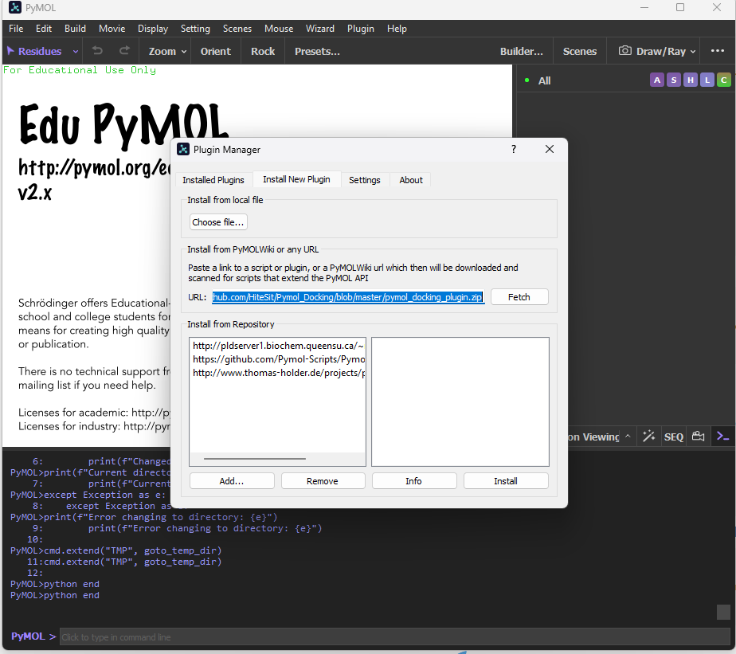

# PyMOL Fitter Plugin

A powerful PyMOL plugin for molecular docking and minimization that leverages Docker containerization to provide robust cross-platform compatibility and consistent computational environments, especially beneficial for Windows users who often encounter dependency issues with computational chemistry software.

## 📋 Features

- **Cross-platform compatibility** through Docker containerization
- **Multiple docking modes**:
    - In-Site: Use 3D ligand structures already loaded in PyMOL
    - Off-Site: Generate 3D conformers from SMILES strings
- **Structure preparation and optimization**:
    - Automated protein preparation
    - Automated ligand preparation and protonation
    - OpenMM-powered minimization of protein-ligand complexes
- **Evaluation and analysis**:
    - Pose assessment with PoseBusters
    - Detailed docking logs and scores
- **User-friendly GUI** integrated into PyMOL's interface

## 🏗️ Architecture

The project is organized into three main components:

1. **PyMOL Plugin (Client)** - `pymol_fitter_plugin/`
    - GUI interface integrated with PyMOL
    - Client code to communicate with the Docker server
    - No computational code - all calculations happen in the Docker container
2. **Server Code** - `pymol_fitter_server/`
    - Flask API endpoints for docking and minimization
    - Computational code using smina, OpenMM, and other libraries
    - Functions for protein preparation, ligand preparation, and pose assessment
3. **Docker Configuration** - `docker/`
    - Dockerfile and docker-compose.yml
    - Environment configuration with all dependencies
    - Data volume for persistent storage of results

## 🔧 Requirements

### System Requirements

- **GPU**: NVIDIA GPU with CUDA support (optional, for faster calculations)
- **Disk Space**: At least 10GB free space for Docker images and data

### Software Requirements

- [Docker](https://www.docker.com/products/docker-desktop/)
- [Pymol3](https://pymol.org/)

## 📥 Installation

### 1a. Pull docker container

1. Simply pull the container
    
    ```bash
    docker pull hitesit/pymol-fitter
    ```
    

### 1b. Set Up the Docker Container

1. Clone this repository:
    
    ```bash
    git clone https://github.com/HiteSit/PyMol_Fitter.git
    cd PyMol_Fitter
    ```
    
2. Build and start the Docker container:
    
    ```bash
    cd docker
    docker-compose up -d
    ```
    

### 2. Install the PyMOL Plugin

1. Install the required Python packages for the client:
   
    > A helpful tip to simplify the installation of these lightweight dependencies is to download PyMOL3 and install the dependencies using the PyMOL2 prompt. Where can you find it? If you have PyMOL3, you can simply search for it in the Start Menu.
    
    ```bash
    pip install requests pathlib
    ```
    
2. Install the plugin from the Pymol-Plugin GUI using the URL:
    
    ```bash
     https://github.com/HiteSit/Pymol_Fitter/blob/master/pymol_fitter_plugin.zip
    ```
    
    
    

## 🚀 Usage Guide

### Starting the Plugin

1. Open PyMOL
2. The plugin will be available in the Plugin menu as "Pymol Fitter"
3. Click on it to open the plugin interface

### Environment Preparation

To perform docking, the plugin requires information about the binding site. This information is retrieved from a crystal ligand. For the plugin to work correctly in your current directory (`$PWD`), you must have a file named `Crystal.sdf` that will be used to define the binding site.

Here's how to create this file:
```python
cd /path/to/working_directory

# Click on the Crystal ligand
save Crystal.sdf, sele
```

### In-Site Docking (Using 3D Structures)

Use this mode when you already have both protein and ligand structures loaded in PyMOL.

1. In the plugin dialog, select "In-Site" from the modality dropdown
2. Choose your protein from the "Protein" dropdown
3. Choose your ligand from the "Ligand" dropdown
4. Select the operation mode:
    - **Dock**: For full docking (finding binding poses)
    - **Minimize**: For optimizing an existing binding pose
5. Enter an output name for the results
6. Click "OK" to start the docking process

### Off-Site Docking (Using SMILES)

Use this mode when you have a protein structure but want to generate a ligand from a SMILES string.

1. In the plugin dialog, select "Off-Site" from the modality dropdown
2. Choose your protein from the "Protein" dropdown
3. Enter the SMILES string for your ligand in the text box
4. Enter an output name for the results
5. Click "OK" to start the docking process

### MD Minimization

This mode allows you to perform molecular dynamics-based minimization (vacuum) on a protein or protein-ligand complex.

1. In the plugin dialog, switch to the "MD Minimization" tab
2. Choose your protein from the "Protein" dropdown
3. If minimizing a complex, choose your ligand from the "Ligand" dropdown
    - Check "Protein-only minimization" if you only want to minimize the protein
4. Enter an output name for the minimized structure
5. Click "OK" to start the minimization process

### Results

After successful docking or minimization:

- The docked ligand will be loaded into PyMOL as a new object
- The prepared protein will be loaded as a separate object
- For minimization, the minimized complex will be loaded
- The (Docker) console will display information about the process

## ⚙️ Technical Details

### Docking Workflow

1. **Protein Preparation**:
    - Removal of non-standard residues and heteroatoms
    - Addition of missing atoms and hydrogens
    - Optimization of hydrogen bonds and minimization
    - Default on Protoss, fallback on PDBFixer
2. **Ligand Preparation**:
    - For SMILES input: 3D structure generation
    - For SDF input: Standardization and hydrogen addition
    - CDPKit-based Protonation
3. **Docking Process**:
    - Binding site detection using reference ligand
    - Docking with Smina
4. **Minimization**:
    - Force field-based energy minimization using OpenMM
    - AMBER ff14SB for proteins
    - GAFF2 for small molecules

### Server API Endpoints

The server exposes the following RESTful API endpoints:

- **GET `/health`**: Check server status
- **POST `/dock`**: Perform docking operation
- **POST `/minimize`**: Perform minimization operation

## 🔍 Troubleshooting

### Common Issues

1. **Docker Container Not Running**:
    
    ```bash
    docker ps | grep pymol-fitter-minimizer
    ```
    
    If no results, try restarting the container:
    
    ```bash
    cd docker
    docker-compose down
    docker-compose up -d
    ```
    
2. **API Connection Errors**:
Test the API directly:
    
    ```bash
    curl http://localhost:5000/health
    ```
    
    If not responding, check Docker logs:
    
    ```bash
    docker logs pymol-fitter-minimizer
    ```
    
3. **Plugin Not Appearing in PyMOL**:
    - Ensure the plugin files are in the correct directory
    - Restart PyMOL
    - Check PyMOL's plugin manager
4. **Docking/Minimization Failures**:
    - Check console output for specific errors
    - Ensure input structures are valid
    - For SMILES inputs, verify the SMILES string is correct
    - For minimization, check for clashes in the input structure

## 📚 Scientific Methods

### Docking Algorithm

This plugin uses smina, a fork of AutoDock Vina with enhanced scoring function options and improved minimization algorithms. The docking process:

### Energy Minimization

The minimization is performed using OpenMM with:

- AMBER ff14SB force field for proteins
- GAFF2 for small molecules
  
The minimization process is highly customizable and encapsulated into a single function (`pymol_fitter_server/pymol_fitter_src/Protein_Minimization.py`). Since it leverages `SystemGenerator`, users can easily swap protein and ligand forcefields as well as incorporate explicit water models.

### Pose Evaluation

PoseBusters is used to evaluate docking poses by checking:

- Atom clashes
- Bond lengths and angles
- Hydrogen bonding networks
- Comparison to reference crystal structures (if available)

## 📋 Citation

If you use this plugin in your research, please cite:

```
@software{pymol_fitter_plugin,
  author = {Riccardo Fusco},
  title = {PyMOL Fitter Plugin},
  year = {2023},
  url = {https://github.com/hitesit/pymol-fitter}
}
```

Additionally, please cite the underlying tools:

- Smina (AutoDock Vina Fork)
- OpenMM
- PoseBusters
- RDKit
- PyMOL

## 🙏 Acknowledgments

This project utilizes several open-source tools and libraries:

- [PyMOL](https://pymol.org/)
- [Smina](https://sourceforge.net/projects/smina/)
- [OpenMM](http://openmm.org/)
- [RDKit](https://www.rdkit.org/)
- [PoseBusters](https://github.com/OpenFreeEnergy/poseBusters)
- [CDPK](https://github.com/molinfo-vienna/CDPKit)
- [Flask](https://flask.palletsprojects.com/)

## 📝 Documentation

This documentation was created with assistance from [Claude 3.7](https://www.anthropic.com/claude).

## 📄 License

This project is licensed under the MIT License - see the LICENSE file for details.